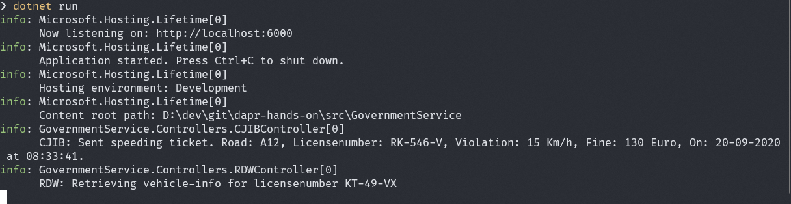
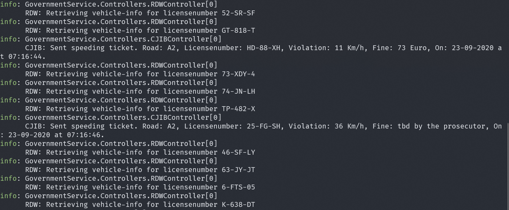

# Assignment 1 - Run the application

In this assignment, you're going to run the application to make sure everything works correctly.

> If you want to check-out the code of the application, open the `Assignment 1` folder in this repo in VS Code.

### Step 1. Run the Government service

1. Open a new command-shell window.

2. Go to the folder `Assignment01/src/GovernmentService`.

3. Start the service using `dotnet run`.

Now you can test whether you can call the Government service's Web-API. You can do this using a browser, CURL or some other HTTP client. But there is a convenient way of testing RESTful APIs directly from VS Code:

4. Install the [**REST Client**](https://github.com/Huachao/vscode-restclient) extension for VS Code.

5. Open the `test.http` file in the in VS Code.

6. Click on `Execute request` in the file to send a request to the API. The result will be shown in a separate window on the right:

   

7. Check the logging in the command-shell window. It should look like this:

   

### Step 2. Run the TrafficControl service

1. Make sure the Government service is running (see step 1).

2. Open a new command-shell window.

3. Go to the folder `Assignment01/src/TrafficControlService`.

4. Start the service using `dotnet run`.

5. Open the `test.http` file in the folder in VS Code.

6. Click on `Execute request` in the file to send a request to the API.

7. Check the logging in both the command-shell windows. The logging should look like this:
   TrafficControl service:

   
   Government service:

   

### Step 3. Run the simulation

You've tested the APIs directly by using a REST client. Now you're going to run the simulation that actually simulates cars driving on the highway. The simulation will simulate 3 entry- and exit-cameras (one for each lane).

1. Make sure both the TrafficControl service and the Government service are running (see step 1 and 2).

2. Open a new command-shell window.

3. Go to the folder `Assignment01/src/Simulation`.

4. Start the service using `dotnet run`.

5. Check the logging in all three command-shell windows. You should see similar output as before for the Government service and TrafficControl service. In the simulation window you should see something like this:

   

Now we know the application runs correctly. It's time to start adding Dapr to the application.

## Next assignment

Make sure you stop all running processes before proceeding to the next assignment.

Go to [assignment 2](../Assignment02/README.md).