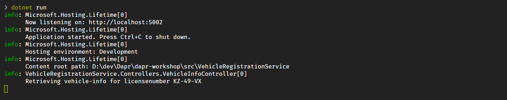
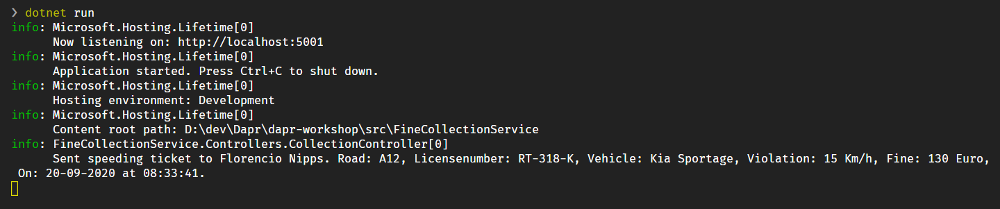
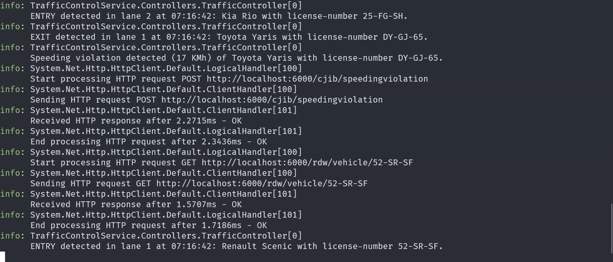
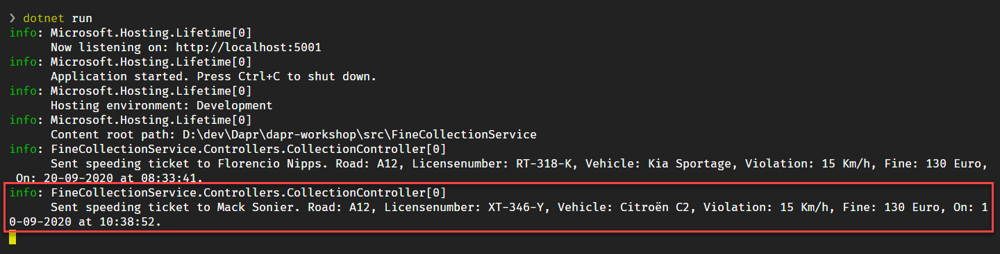
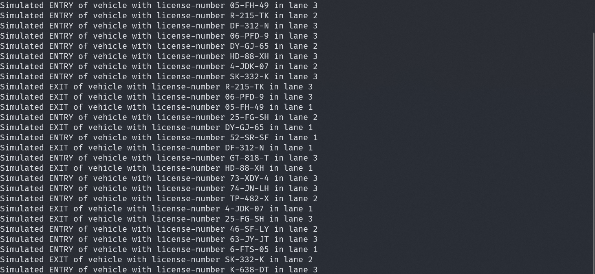

# Assignment 1 - Run the application

In this assignment, you're going to run the application to make sure everything works correctly.

> Before executing this assignment, I suggest you check-out the code of the different services. Uou can open the `src` folder in this repo in VS Code.

## Step 1. Run the VehicleRegistration service

1. Open a new terminal window in VS Code.

   > You can do this by clicking on the `+` button in the Terminal Window title-bar or by using the hotkey ``Ctrl-Shift-` ``.

2. Go to the folder `src/VehicleRegistrationService`.

3. Start the service using `dotnet run`.

> If you receive an error here, please double-check whether or not you have installed all the [prerequisites](..\README.md#Prerequisites) ) for the workshop!

Now you can test whether you can call the Government service's Web-API. You can do this using a browser, CURL or some other HTTP client. But there is a convenient way of testing RESTful APIs directly from VS Code:

1. Open the `test.http` file in the project folder in VS Code. The request in this file simulates retrieving the vehicle- and owner information for a certain license-number.

1. Click on `Execute request` in the file to send a request to the API. The result will be shown in a separate window on the right:

   

1. Check the logging in the command-shell window. It should look like this:

   

## Step 2. Run the FineCollection service

1. Make sure the VehicleRegistrationService service is running (see step 1).
1. Open a new terminal window in VS Code.
1. Go to the folder `src/FineCollectionService`.
1. Start the service using `dotnet run`.

1. Open the `test.http` file in the project folder in VS Code. The request in this file simulates sending a detected speeding-violation to the FineCollectionService.

1. Click on `Execute request` in the file to send a request to the API. The result will be shown in a separate window on the right.

1. Check the logging in the command-shell window. It should look like this:

   

## Step 3. Run the TrafficControl service

1. Make sure the VehicleRegistrationService and FineCollectionService are running (see step 1 and 2).

1. Open a new terminal window in VS Code.

1. Go to the folder `src/TrafficControlService`.

1. Start the service using `dotnet run`.

1. Open the `test.http` file in the project folder in VS Code.

1. Click on `Execute request` for both requests in the file to send two requests to the API. The result will be shown in a separate window on the right.

1. Check the logging in the command-shell window. It should look like this:

   

   If you now also inspect the logging of the FineCollectionService (select the other Terminal in the dropdown on the title-bar of the Terminal Window), you should see the speeding-violation being logged:

   

## Step 3. Run the simulation

You've tested the APIs directly by using a REST client. Now you're going to run the simulation that actually simulates cars driving on the highway. The simulation will simulate 3 entry- and exit-cameras (one for each lane).

1. Open a new terminal window in VS Code.

2. Go to the folder `src/Simulation`.

3. Start the service using `dotnet run`.

4. In the simulation window you should see something like this:

   

5. Also check the logging in all the other Terminal windows. You should see all entry- and exit events and any speeding-violations that were detected in the logging.

Now we know the application runs correctly. It's time to start adding Dapr to the application.

## Next assignment

Make sure you stop all running processes and close all the terminal windows in VS Code before proceeding to the next assignment.

Go to [assignment 2](../Assignment02/README.md).
