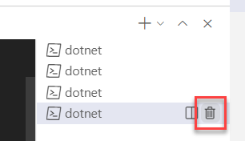

# Assignment 1 - Run the application

In this assignment, you'll run the application to make sure everything works correctly.

## Assignment goals

To complete this assignment, you must reach the following goals:

- All services are running.
- The logging indicates that all services are working correctly.

As a reminder, this is how the services will interact with each other:


## Step 1. Run the VehicleRegistration service

1. Open the source code folder in VS Code. This guide assumes VS Code, but feel free to use an editor or IDE you're comfortable with.

   > Throughout the assignment you can execute all steps in the same instance of editor or IDE window.

1. Open a terminal window.

   > You can do this by using the hotkey ``Ctrl-` `` (Windows) or ``Shift-Ctrl-` `` (macOS).

1. Make sure the current folder is `VehicleRegistrationService`.

1. Start the service using `mvn spring-boot:run`.

> If you receive an error here, please double-check whether or not you have installed all the [prerequisites](../README.md#Prerequisites) for the workshop!

Now you can test whether you can call the VehicleRegistrationService. You can do this using a browser, cURL or some other HTTP client. But there is a convenient way of testing RESTful APIs directly from VS Code (this uses the REST Client extension VS Code):

1. Open the file `VehicleRegistrationService/test.http` in your editor. The request in this file simulates retrieving the vehicle- and owner information for a certain license-number.

1. Click on `Send request` in the file to send a request to the API:

   
   
1. The response of the request will be shown in a separate window on the right. It should be a response with HTTP status code `200 OK` and the body should contain some random vehicle and owner-information:

   ```json
   HTTP/1.1 200 
   Connection: keep-alive
   Content-Type: application/json
   Date: Wed, 16 Jun 2021 19:39:05 GMT
   Keep-Alive: timeout=60
   Transfer-Encoding: chunked
   
   {
       "vehicleId": "KZ-49-VX",
       "brand": "Toyota",
       "model": "Rav 4",
       "ownerName": "Angelena Fairbairn",
       "ownerEmail": "angelena.fairbairn@outlook.com"
   }
   ```

1. Check the logging in the terminal window. It should look like this:

   ```console
   2021-09-15 13:42:01.030  INFO 14048 --- [           main] d.v.VehicleRegistrationApplication       : Started VehicleRegistrationApplication in 2.031 seconds (JVM running for 2.386)
   2021-09-15 13:42:11.519  INFO 14048 --- [nio-6002-exec-1] o.a.c.c.C.[Tomcat].[localhost].[/]       : Initializing Spring DispatcherServlet 'dispatcherServlet'
   2021-09-15 13:42:11.519  INFO 14048 --- [nio-6002-exec-1] o.s.web.servlet.DispatcherServlet        : Initializing Servlet 'dispatcherServlet'
   2021-09-15 13:42:11.520  INFO 14048 --- [nio-6002-exec-1] o.s.web.servlet.DispatcherServlet        : Completed initialization in 1 ms
   2021-09-15 13:42:11.544  INFO 14048 --- [nio-6002-exec-1] dapr.vehicle.VehicleInfoController       : Retrieving vehicle-info for license number KZ-49-VX
   ```

## Step 2. Run the FineCollection service

1. Make sure the VehicleRegistrationService service is running (result of step 1).

1. Open a **new** terminal window in VS Code.

   > You can do this by using the hotkey (``Ctrl-` `` on Windows, ``Shift-Ctrl-` `` on macOS) or clicking on the `+` button in the terminal window title bar:  
   > 

1. Make sure the current folder is `FineCollectionService`.

1. Start the service using `mvn spring-boot:run`.

1. Open the file `FineCollectionService/test.http` in VS Code. The request in this file simulates sending a detected speeding-violation to the FineCollectionService.

1. Click on `Execute request` in the file to send a request to the API.

1. The response of the request will be shown in a separate window on the right. It should be a response with HTTP status code `200 OK` and no body.

1. Check the logging in the terminal window. It should look like this:

   ```console
   2021-09-15 13:43:58.766  INFO 16412 --- [           main] dapr.fines.FineCollectionApplication     : Started FineCollectionApplication in 2.033 seconds (JVM running for 2.422)
   2021-09-15 13:44:02.464  INFO 16412 --- [nio-6001-exec-1] o.a.c.c.C.[Tomcat].[localhost].[/]       : Initializing Spring DispatcherServlet 'dispatcherServlet'
   2021-09-15 13:44:02.464  INFO 16412 --- [nio-6001-exec-1] o.s.web.servlet.DispatcherServlet        : Initializing Servlet 'dispatcherServlet'
   2021-09-15 13:44:02.465  INFO 16412 --- [nio-6001-exec-1] o.s.web.servlet.DispatcherServlet        : Completed initialization in 1 ms
   2021-09-15 13:44:02.613  INFO 16412 --- [nio-6001-exec-1] dapr.fines.violation.ViolationProcessor  : Sent fine notification
            To Genevieve Burnside, registered owner of license number RT-318-K.
            Violation of 15 km/h detected on the A12 road on September, 20 2020 at 08:33:41.
            Fine: EUR 130.00.
   ```

## Step 3. Run the TrafficControl service

1. Make sure the VehicleRegistrationService and FineCollectionService are running (results of step 1 and 2).

1. Open a **new** terminal window in VS Code and make sure the current folder is `TrafficControlService`.

1. Start the service using `mvn spring-boot:run`.

1. Open the `TrafficControlService/test.http` file in VS Code.

1. Click on `Execute request` for all three requests in the file to send two requests to the API.

1. The response of the requests will be shown in a separate window on the right. Both requests should yield a response with HTTP status code `200 OK` and no body.

1. Check the logging in the terminal window. It should look like this:

   ```console
   2021-09-15 13:45:41.497  INFO 22453 --- [           main] dapr.traffic.TrafficControlApplication   : Started TrafficControlApplication in 1.812 seconds (JVM running for 2.187)
   2021-09-15 13:46:01.675  INFO 22453 --- [nio-6000-exec-1] o.a.c.c.C.[Tomcat].[localhost].[/]       : Initializing Spring DispatcherServlet 'dispatcherServlet'
   2021-09-15 13:46:01.675  INFO 22453 --- [nio-6000-exec-1] o.s.web.servlet.DispatcherServlet        : Initializing Servlet 'dispatcherServlet'
   2021-09-15 13:46:01.676  INFO 22453 --- [nio-6000-exec-1] o.s.web.servlet.DispatcherServlet        : Completed initialization in 0 ms
   2021-09-15 13:46:01.757  INFO 22453 --- [nio-6000-exec-1] dapr.traffic.TrafficController           : ENTRY detected in lane 1 at 10:38:47 of vehicle with license number XT-346-Y.
   2021-09-15 13:46:03.537  INFO 22453 --- [nio-6000-exec-2] dapr.traffic.TrafficController           :  EXIT detected in lane 1 at 10:38:53 of vehicle with license number XT-346-Y.
   2021-09-15 13:46:05.969  INFO 22453 --- [nio-6000-exec-3] dapr.traffic.TrafficController           :  EXIT detected in lane 1 at 10:38:52 of vehicle with license number XT-346-Y.
   2021-09-15 13:46:05.970  INFO 22453 --- [nio-6000-exec-3] dapr.traffic.TrafficController           : Speeding violation by vehicle XT-346-Y detected: 15 km/h
   ```

1. Also inspect the logging of the FineCollectionService.

   > You can select another terminal window by clicking on it in the **tabs view** on the right side of the terminal window:  
   > 

   You should see the speeding-violation being handled by the FineCollectionService:

   ```console
   2021-09-15 13:46:06.024  INFO 16412 --- [nio-6001-exec-2] dapr.fines.violation.ViolationProcessor  : Sent fine notification
            To Rosa Goeke, registered owner of license number XT-346-Y.
            Violation of 15 km/h detected on the A12 road on September, 10 2020 at 10:38:52.
            Fine: EUR 130.00.
   ```

## Step 4. Run the simulation

You've tested the APIs directly by using a REST client. Now you're going to run the simulation that actually simulates cars driving on the highway. The simulation will simulate 3 entry- and exit-cameras (one for each lane).

1. Open a new terminal window in VS Code and make sure the current folder is `Simulation`.

1. Start the service using `mvn spring-boot:run`.

1. In the simulation window you should see something like this:

   ```console
   2021-09-15 13:47:59.599  INFO 22875 --- [           main] dapr.simulation.SimulationApplication    : Started SimulationApplication in 0.98 seconds (JVM running for 1.289)
   2021-09-15 13:47:59.603  INFO 22875 --- [pool-1-thread-2] dapr.simulation.Simulation               : Start camera simulation for lane 1
   2021-09-15 13:47:59.603  INFO 22875 --- [pool-1-thread-1] dapr.simulation.Simulation               : Start camera simulation for lane 0
   2021-09-15 13:47:59.603  INFO 22875 --- [pool-1-thread-3] dapr.simulation.Simulation               : Start camera simulation for lane 2
   2021-09-15 13:47:59.679  INFO 22875 --- [pool-1-thread-2] dapr.simulation.Simulation               : Simulated ENTRY of vehicle with license number 77-ZK-59 in lane 1
   2021-09-15 13:47:59.869  INFO 22875 --- [pool-1-thread-3] dapr.simulation.Simulation               : Simulated ENTRY of vehicle with license number LF-613-D in lane 2
   2021-09-15 13:48:00.852  INFO 22875 --- [pool-1-thread-1] dapr.simulation.Simulation               : Simulated ENTRY of vehicle with license number 12-LZ-KS in lane 0
   2021-09-15 13:48:04.797  INFO 22875 --- [pool-1-thread-2] dapr.simulation.Simulation               : Simulated  EXIT of vehicle with license number 77-ZK-59 in lane 0
   2021-09-15 13:48:04.894  INFO 22875 --- [pool-1-thread-3] dapr.simulation.Simulation               : Simulated  EXIT of vehicle with license number LF-613-D in lane 0
   ```

1. Also check the logging in all the other Terminal windows. You should see all entry- and exit events and any speeding-violations that were detected in the logging.

Now we know the application runs correctly. It's time to start adding Dapr to the application.

## Next assignment

Make sure you stop all running processes and close all the terminal windows in VS Code before proceeding to the next assignment. Stopping a service or the simulation is done by pressing `Ctrl-C` in the terminal window. To close the terminal window, enter the `exit` command.

> You can quickly close a terminal window by clicking on the trashcan icon in its title bar:
> 

Go to [assignment 2](../Assignment02/README.md).
