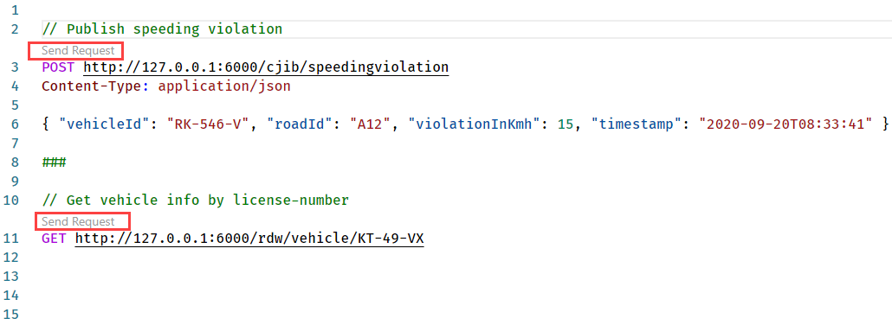
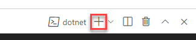
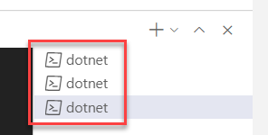
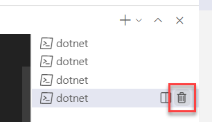
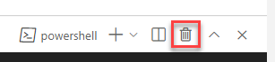

# Assignment 1 - Run the application

In this assignment, you'll run the application to make sure everything works correctly.

## Assignment goals

To complete this assignment, you must reach the following goals:

- All services are running.
- The logging indicates that all services are working correctly.

As a reminder, this is how the services will interact with each other:


## Step 1. Run the VehicleRegistration service

1. Open the source code folder in VS Code.

   > Throughout the assignment you need to execute all steps in the same instance of VS Code.

1. Open the terminal window in VS Code.

   > You can do this by using the hotkey ``Ctrl-` `` (Windows) or ``Shift-Ctrl-` `` (macOS).

1. Make sure the current folder is `VehicleRegistrationService`.

1. Start the service using `dotnet run`.

> If you receive an error here, please double-check whether or not you have installed all the [prerequisites](../README.md#Prerequisites) for the workshop!

Now you can test whether you can call the VehicleRegistrationService. You can do this using a browser, cURL or some other HTTP client. But there is a convenient way of testing RESTful APIs directly from VS Code (this uses the REST Client extension VS Code):

1. Open the file `VehicleRegistrationService/test.http` in VS Code. The request in this file simulates retrieving the vehicle- and owner information for a certain license-number.

1. Click on `Send request` in the file to send a request to the API:

   

1. The response of the request will be shown in a separate window on the right. It should be a response with HTTP status code `200 OK` and the body should contain some random vehicle and owner-information:

   ```json
   HTTP/1.1 200 OK
   Connection: close
   Date: Mon, 01 Mar 2021 07:15:55 GMT
   Content-Type: application/json; charset=utf-8
   Server: Kestrel
   Transfer-Encoding: chunked
   
   {
       "vehicleId": "KZ-49-VX",
       "brand": "Toyota",
       "model": "Rav 4",
       "ownerName": "Angelena Fairbairn",
       "ownerEmail": "angelena.fairbairn@outlook.com"
   }
   ```

1. Check the logging in the terminal window. It should look like this:

   ```console
   ❯ dotnet run
   info: Microsoft.Hosting.Lifetime[0]
         Now listening on: http://localhost:6002
   info: Microsoft.Hosting.Lifetime[0]
         Application started. Press Ctrl+C to shut down.
   info: Microsoft.Hosting.Lifetime[0]
         Hosting environment: Development
   info: Microsoft.Hosting.Lifetime[0]
         Content root path: D:\dev\Dapr\dapr-workshop\dotnet\VehicleRegistrationService
   info: VehicleRegistrationService.Controllers.VehicleInfoController[0]
         Retrieving vehicle-info for licensenumber KZ-49-VX
   ```

## Step 2. Run the FineCollection service

1. Make sure the VehicleRegistrationService service is running (result of step 1).

1. Open a **new** terminal window in VS Code.

   > You can do this by using the hotkey (``Ctrl-` `` on Windows, ``Shift-Ctrl-` `` on macOS) or clicking on the `+` button in the terminal window title bar:  
   > 

1. Make sure the current folder is `FineCollectionService`.

1. Start the service using `dotnet run`.

1. Open the file `FineCollectionService/test.http` in VS Code. The request in this file simulates sending a detected speeding-violation to the FineCollectionService.

1. Click on `Execute request` in the file to send a request to the API.

1. The response of the request will be shown in a separate window on the right. It should be a response with HTTP status code `200 OK` and no body.

1. Check the logging in the terminal window. It should look like this:

   ```console
   ❯ dotnet run
   info: Microsoft.Hosting.Lifetime[0]
         Now listening on: http://localhost:6001
   info: Microsoft.Hosting.Lifetime[0]
         Application started. Press Ctrl+C to shut down.
   info: Microsoft.Hosting.Lifetime[0]
         Hosting environment: Development
   info: Microsoft.Hosting.Lifetime[0]
         Content root path: D:\dev\Dapr\dapr-workshop\dotnet\FineCollectionService
   info: System.Net.Http.HttpClient.Default.LogicalHandler[100]
         Start processing HTTP request GET http://localhost:6002/vehicleinfo/RT-318-K
   info: System.Net.Http.HttpClient.Default.ClientHandler[100]
         Sending HTTP request GET http://localhost:6002/vehicleinfo/RT-318-K
   info: System.Net.Http.HttpClient.Default.ClientHandler[101]
         Received HTTP response headers after 148.5761ms - 200
   info: System.Net.Http.HttpClient.Default.LogicalHandler[101]
         End processing HTTP request after 156.5675ms - 200
   info: FineCollectionService.Controllers.CollectionController[0]
         Sent speeding ticket to Cassi Dakes. Road: A12, Licensenumber: RT-318-K, Vehicle: Mercedes SLK, Violation: 15 Km/h, Fine: 130 Euro, On: 20-09-2020 at 08:33:41.
   ```

## Step 3. Run the TrafficControl service

1. Make sure the VehicleRegistrationService and FineCollectionService are running (results of step 1 and 2).

1. Open a **new** terminal window in VS Code and make sure the current folder is `TrafficControlService`.

1. Start the service using `dotnet run`.

1. Open the `test.http` file in the project folder in VS Code.

1. Click on `Execute request` for both requests in the file to send two requests to the API.

1. The response of the requests will be shown in a separate window on the right. Both requests should yield a response with HTTP status code `200 OK` and no body.

1. Check the logging in the terminal window. It should look like this:

   ```console
   ❯ dotnet run
   info: Microsoft.Hosting.Lifetime[0]
         Now listening on: http://localhost:6000
   info: Microsoft.Hosting.Lifetime[0]
         Application started. Press Ctrl+C to shut down.
   info: Microsoft.Hosting.Lifetime[0]
         Hosting environment: Development
   info: Microsoft.Hosting.Lifetime[0]
         Content root path: D:\dev\Dapr\dapr-workshop\dotnet\TrafficControlService
   info: TrafficControlService.Controllers.TrafficController[0]
         ENTRY detected in lane 1 at 10:38:47 of vehicle with license-number XT-346-Y.
   info: TrafficControlService.Controllers.TrafficController[0]
         EXIT detected in lane 1 at 10:38:52 of vehicle with license-number XT-346-Y.
   info: TrafficControlService.Controllers.TrafficController[0]
         Speeding violation detected (15 KMh) of vehiclewith license-number XT-346-Y.
   info: System.Net.Http.HttpClient.Default.LogicalHandler[100]
         Start processing HTTP request POST http://localhost:6001/collectfine
   info: System.Net.Http.HttpClient.Default.ClientHandler[100]
         Sending HTTP request POST http://localhost:6001/collectfine
   info: System.Net.Http.HttpClient.Default.ClientHandler[101]
         Received HTTP response headers after 254.3259ms - 200
   info: System.Net.Http.HttpClient.Default.LogicalHandler[101]
         End processing HTTP request after 264.8462ms - 200
   ```

1. Also inspect the logging of the FineCollectionService.

   > You can select another terminal window by clicking on it in the **tabs view** on the right side of the terminal window:  
   > 

   You should see the speeding-violation being handled by the FineCollectionService:

   ```console
   info: System.Net.Http.HttpClient.Default.LogicalHandler[100]
         Start processing HTTP request GET http://localhost:6002/vehicleinfo/XT-346-Y
   info: System.Net.Http.HttpClient.Default.ClientHandler[100]
         Sending HTTP request GET http://localhost:6002/vehicleinfo/XT-346-Y
   info: System.Net.Http.HttpClient.Default.ClientHandler[101]
         Received HTTP response headers after 175.9129ms - 200
   info: System.Net.Http.HttpClient.Default.LogicalHandler[101]
         End processing HTTP request after 176.0221ms - 200
   info: FineCollectionService.Controllers.CollectionController[0]
         Sent speeding ticket to Refugio Petterson. Road: A12, Licensenumber: XT-346-Y, Vehicle: Fiat Panda, Violation: 15 Km/h, Fine: 130 Euro, On: 10-09-2020 at 10:38:52.
   ```

## Step 4. Run the simulation

You've tested the APIs directly by using a REST client. Now you're going to run the simulation that actually simulates cars driving on the highway. The simulation will simulate 3 entry- and exit-cameras (one for each lane).

1. Open a new terminal window in VS Code and make sure the current folder is `Simulation`.

1. Start the service using `dotnet run`.

1. In the simulation window you should see something like this:

   ```console
   ❯ dotnet run
   Start camera 2 simulation.
   Start camera 3 simulation.
   Start camera 1 simulation.
   Simulated ENTRY of vehicle with license-number Y-373-JF in lane 2
   Simulated ENTRY of vehicle with license-number RL-001-D in lane 2
   Simulated ENTRY of vehicle with license-number TF-352-N in lane 3
   Simulated ENTRY of vehicle with license-number JY-94-SY in lane 1
   Simulated ENTRY of vehicle with license-number 4-JSL-09 in lane 1
   Simulated ENTRY of vehicle with license-number 87-DGR-7 in lane 3
   Simulated ENTRY of vehicle with license-number 44-FK-64 in lane 2
   Simulated EXIT of vehicle with license-number Y-373-JF in lane 3
   Simulated ENTRY of vehicle with license-number TH-822-X in lane 1
   Simulated ENTRY of vehicle with license-number G-127-SN in lane 2
   Simulated ENTRY of vehicle with license-number 44-TN-JD in lane 3
   Simulated ENTRY of vehicle with license-number T-252-NJ in lane 2
   Simulated ENTRY of vehicle with license-number 1-HXS-04 in lane 2
   Simulated EXIT of vehicle with license-number RL-001-D in lane 1
   Simulated ENTRY of vehicle with license-number DJ-940-S in lane 1
   ```

1. Also check the logging in all the other Terminal windows. You should see all entry- and exit events and any speeding-violations that were detected in the logging.

Now we know the application runs correctly. It's time to start adding Dapr to the application.

## Next assignment

Make sure you stop all running processes and close all the terminal windows in VS Code before proceeding to the next assignment. Stopping a service or the simulation is done by pressing `Ctrl-C` in the terminal window. To close the terminal window, enter the `exit` command.

> You can quickly close a terminal window by clicking on the trashcan icon next to the terminal instance in the **tabs view** on the right side of the terminal window:  
>
> 
> 
>or in the title-bar if you have only 1 terminal window open:  
>
> 

Go to [assignment 2](../Assignment02/README.md).
