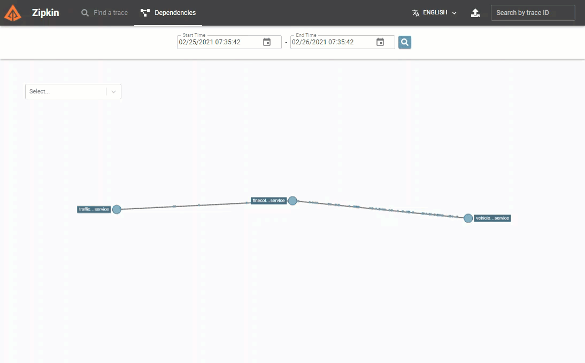

# Assignment 2 - Add Dapr service-to-service invocation

## Assignment goals

To complete this assignment, you must reach the following goals:

- The VehicleRegistrationService and FineCollectionService are both running with a Dapr sidecar.
- The FineCollectionService uses the Dapr service invocation building block to call the `/vehicleinfo/{licensenumber}` endpoint on the VehicleRegistrationService.

This assignment targets number **1** in the end-state setup:


## Step 1: Start the VehicleRegistrationService with Dapr

In assignment 1, you started all the services using `mvn spring-boot:run`. When you want to run a service with a Dapr sidecar that handles its communication, you need to start it using the Dapr CLI. There are a couple of things you need to specify when starting the service:

- The service needs a unique id which Dapr can use to find it. This is called the *app-id* (or application Id). You specify this with the `--app-id` flag on the command-line.

- Each of the services listens on a different HTTP port for requests (to prevent port collisions on localhost). The VehicleRegistrationService runs on port `6002` for instance. You need to tell Dapr this port so the Dapr sidecar can communicate with the service. You specify this with the `--app-port` flag on the command-line.

- The service can use HTTP or gRPC to communicate with the Dapr sidecar. By default these ports are `3500` and `50001`. But to prevent confusion, you'll use totally different port numbers in the assignments. To prevent port collisions on the local machine when running multiple services, you have to specify a unique HTTP and gRPC port per service. You specify this with the `--dapr-http-port` and `--dapr-grpc-port` flags on the command-line. Throughout the workshop, you will use the following ports:

  | Service                    | Application Port | Dapr sidecar HTTP port | Dapr sidecar gRPC port |
  | -------------------------- | ---------------- | ---------------------- | ---------------------- |
  | TrafficControlService      | 6000             | 3600                   | 60000                  |
  | FineCollectionService      | 6001             | 3601                   | 60001                  |
  | VehicleRegistrationService | 6002             | 3602                   | 60002                  |

- Finally you need to tell Dapr how to start the service. The services are Java/Spring Boot services which can be started with the command `mvn spring-boot:run`.

You will use the `run` command of the Dapr CLI and specify all the options above on the command-line:

1. Make sure you have started Docker Desktop on your machine and the Dapr CLI and runtime are installed (see the [prerequisites](../README.md#prerequisites)).

2. Open the `src-java` folder in this repo in VS Code.

3. Open the terminal window in VS Code and make sure the current folder is `src/VehicleRegistrationService`.

4. Enter the following command to run the VehicleRegistrationService with a Dapr sidecar:

   ```console
   dapr run --app-id vehicleregistrationservice --app-port 6002 --dapr-http-port 3602 --dapr-grpc-port 60002 mvn spring-boot:run
   ```

5. Check the logs for any errors. As you can see, both Dapr as well as application logging is shown as output.

Now you're running a 'Daprized' version of the VehicleRegistrationService. As you might have noticed, you didn't need to change any code for this to work. The VehicleRegistrationService is still just a web API listening for requests. Only now, you've started it with a Dapr sidecar next to it that can communicate with it. This means other services can use Dapr to call this service. This is what you'll do in the next step.

## Step 2: Call the VehicleRegistrationService using Dapr service invocation

In this step, you're going to change the code of the FineCollectionService so it uses Dapr service invocation to call the VehicleRegistrationService.

First you're going to change the code so it calls the Dapr sidecar:

1. Open the file `src-java/FineCollectionService/src/main/java/dapr/fines/vehicle/DefaultVehicleRegistrationClient.java` in VS Code.

1. Inspect the `getVehicleInfo` method. It contains a call to the VehicleRegistrationService to retrieve the vehicle info:

   ```java
   var params = Map.of("licenseNumber", licenseNumber);
   return restTemplate.getForObject(vehicleInformationAddress, VehicleInfo.class, params);
   ```

   The `restTemplate` is a utility provided by Spring to invoke the VehicleRegistrationService. Its base address for consuming that REST web service is injected through the constructor of that class. That constructor is invoked from a Spring configuration class, which in turn reads the Spring configuration file using `@Value`.

1. Open the file `src-java/FineCollectionService/src/main/resources/application.yml` in VS Code.

   Here we see the actual value being configured. Inspect the `vehicle-information.address` setting. You can see that in the HTTP call, the URL of the VehicleRegistrationService (running on port 6002) is used.

1. The API for calling the Dapr service invocation building block on a Dapr sidecar is:

   ```http
   http://localhost:<daprPort>/v1.0/invoke/<appId>/method/<method-name>
   ```

   You can substitute the placeholders in this URL with values for the VehicleRegistrationService, this yields the following URL:

   ```http
   http://localhost:3601/v1.0/invoke/vehicleregistrationservice/method/vehicleinfo/{licenseNumber}
   ```

   As you can see in this URL, the FineCollectionService's Dapr sidecar will run on HTTP port `3601`.

1. Replace the URL in the configuration file with the new Dapr service invocation URL. The file should now look like this:

   ```yml
   vehicle-information:
     address: http://localhost:3601/v1.0/invoke/vehicleregistrationservice/method/vehicleinfo/{licenseNumber}
   ```

   > It's important to really grasp the sidecar pattern used by Dapr. In this case, the FineCollectionService calls the VehicleRegistrationService by **calling its own Dapr sidecar**! The FineCollectionService doesn't need to know anymore where the VehicleRegistrationService lives because its Dapr sidecar will take care of that. It will find it based on the `app-id` specified in the URL and call the target service's sidecar.

1. Open a **new** terminal window in VS Code and make sure the current folder is `src-java/FineCollectionService`.

1. Check all your code-changes are correct by building the code:

   ```console
   mvn package
   ```

   If you see any warnings or errors, review the previous steps to make sure the code is correct.

1. Enter the following command to run the FineCollectionService with a Dapr sidecar:

   ```console
   dapr run --app-id finecollectionservice --app-port 6001 --dapr-http-port 3601 --dapr-grpc-port 60001 mvn spring-boot:run
   ```

1. Check the logs for any errors. As you can see, both Dapr as well as application logging is shown as output.

Now you're going to test the application:

1. Open a **new** terminal window in VS Code and change the current folder to `src-java/TrafficControlService`.

1. Enter the following command to run the TrafficControlService:

1. ```console
   mvn spring-boot:run
   ```

> The TrafficControlService does not need to run with a Dapr sidecar in this assignment. This is because it will still call the FineCollectionService over HTTP as before.

The services are up & running. Now you're going to test this using the simulation.

1. Open a **new** terminal window in VS Code and change the current folder to `src-java/Simulation`.

1. Start the simulation:

   ```console
   mvn spring-boot:run
   ```

You should see similar logging as before when you ran the application. So all the functionality works the same, but now you use Dapr service invocation to communicate between the FineCollectionService and the VehicleRegistrationService.

## Step 3: Use Dapr service invocation with the Dapr SDK for Java

In this step, you're going to change the code of the FineCollectionService so it uses the Dapr SDK for Java to call the VehicleRegistrationService. The SDK provides a more integrated way to invoke the Dapr sidecar API.

First stop the simulation:

1. Open the terminal window in VS Code in which the Camera Simulation runs.

1. Stop the simulation by pressing `Ctrl-C` and close the terminal window by clicking the trashcan icon in its title bar (or typing the `exit` command).

1. Open the terminal window in VS Code in which the FineCollectionService runs.

1. Stop the service by pressing `Ctrl-C`. Keep this terminal window open and focused.

1. Add a dependency to the Dapr SDK for Java to the `pom.xml` in the FineCollectionService directory:

   ```xml
   <dependency>
       <groupId>io.dapr</groupId>
       <artifactId>dapr-sdk</artifactId>
   </dependency>
   ```

   The version of the dependency is managed using Mavens "dependency management" - you can inspect the `pom.xml` file inside the `src-java` folder to see the exact version.

   > The Dapr SDK for Java contains the `DaprClient` class that we will use to directly invoke the Dapr API. There is also an additional library that integrates with Spring Boot, but we don't need that yet. It is only necessary for building application that _offer_ services with Dapr.

Now you'll change the code to use the Dapr-provided `DaprClient` to call the VehicleRegistrationService. In step 2 we used the existing code based on Spring's `RestTemplate`, keeping our code unaware of Dapr. The Dapr SDK for Java ensures that calls are routed through the Dapr sidecar.

1. Create a new file, `src-java/FineCollectionService/src/main/java/dapr/fines/vehicle/DaprVehicleRegistrationClient.java` and open it in VS Code.

1. Declare a class `DaprVehicleRegistrationClient` that implements the `VehicleRegistrationClient` interface. To fulfil the contract of the `VehicleRegistrationClient` interface, add the following method:

   ```java
   @Override
   public VehicleInfo getVehicleInfo(String licenseNumber) {
       return null;
   }
   ```

1. Open the file `src-java/FineCollectionService/src/main/java/dapr/fines/FineCollectionConfiguration.java` in VS Code.
   Add a new method to declare a Spring Bean of type `DaprClient`:
   
   ```java
   @Bean
   public DaprClient daprClient() {
       return new DaprClientBuilder().build();
   }
   ```

   In the same class, the `vehicleRegistrationClient` method declares a Spring Bean that provides an implementation of the `VehicleRegistrationClient` interface. To do so, it needs a `RestTemplate` bean. Replace this method with the following:

   ```java
   @Bean
   public VehicleRegistrationClient vehicleRegistrationClient(final DaprClient daprClient) {
       return new DaprVehicleRegistrationClient(daprClient);
   }
   ```

   Finally, update the import statements in the class:

   ```java
   import dapr.fines.vehicle.DaprVehicleRegistrationClient;
   import io.dapr.client.DaprClient;
   import io.dapr.client.DaprClientBuilder;
   ```

1. Go back to the `DaprVehicleRegistrationClient` implementation class and add a using statement in this file to make sure you can use the Dapr client:

   ```java
   import io.dapr.client.DaprClient;
   import io.dapr.client.domain.HttpExtension;

   import java.time.Duration;
   ```

   Now add an instance variable of type `DaprClient`, and add a constructor to inject it:

   ```java
   public class DaprVehicleRegistrationClient implements VehicleRegistrationClient {
       private final DaprClient daprClient;

       public DaprVehicleRegistrationClient(final DaprClient daprClient) {
          this.daprClient = daprClient;
       }
   ```

   Finally, update the `getVehicleInfo()` method in this class to use the `DaprClient`:

   ```java
   var result = daprClient.invokeMethod(
            "vehicleregistrationservice",
            "vehicleinfo/" + licenseNumber,
            null,
            HttpExtension.GET,
            VehicleInfo.class
   );

   return result.block(Duration.ofMillis(100));
   ```

   As you can see in this snippet, this code does not require our application to know the _address_ of the Vehicle Registration Service, only it's _name_. With each call to the `DaprClient`, you specify the `app-id` of the service you want to communicate with.

   > Also note that the `invokeMethod` method of the `DaprClient` returns a `Mono`. Because we don't want to get distracted by all the possibilities that reactive progamming brings, we immediately invoke `block` to await the result. In a real-world scenario, it would make more sense to propagate that Mono through our application to make it more reactive.

Now the FineCollectionService is changed to use the Dapr SDK for service invocation. Let's test this.

1. If you followed the instructions in this assignment, the VehicleRegistrationService and TrafficControlService are still running.

1. Open the terminal window in VS Code in which the FineCollectionService was running.

1. Enter the following command to start the changed FineCollectionService again:

   ```console
   dapr run --app-id finecollectionservice --app-port 6001 --dapr-http-port 3601 --dapr-grpc-port 60001 mvn spring-boot:run
   ```

The services are up & running. Now you're going to test this using the simulation.

1. Open a **new** terminal window in VS Code and change the current folder to `src-java/Simulation`.

1. Start the simulation:

   ```console
   mvn spring-boot:run
   ```

You should see similar logging as before when you ran the application.

## Step 4: Use Dapr observability

So how can you check whether or not the call to the VehicleRegistrationService is handled by Dapr? Well, Dapr has some observability built in. You can look at Dapr traffic using Zipkin:

1. Open a browser and go the this URL: [http://localhost:9411/zipkin](http://localhost:9411/zipkin).

2. Click the `RUN QUERY` button in the top right of the screen to search for traces.

3. You should see the calls between the FineCollectionService and the VehicleRegistrationService. You can expand and collapse each trace and click the `SHOW` button to get more details:

   

4. If you click the dependencies button and search, you will see the services and the traffic flowing between them:

   

## Next assignment

Make sure you stop all running processes and close all the terminal windows in VS Code before proceeding to the next assignment.

Go to [assignment 3](../Assignment03/README.md).
