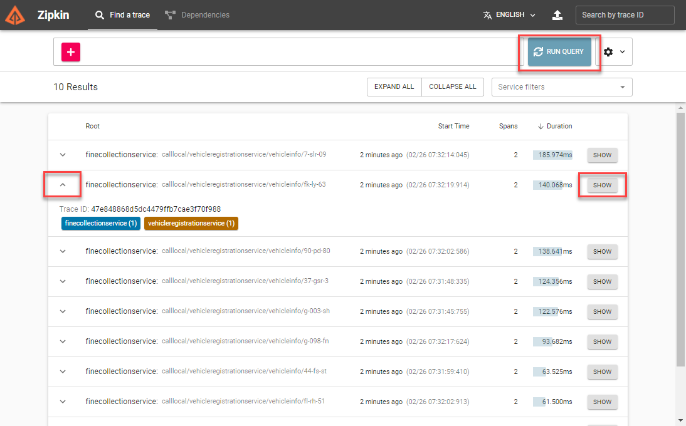
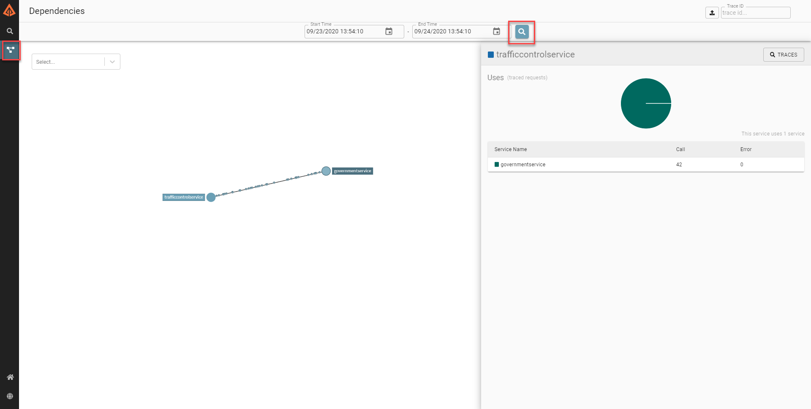

# Assignment 2 - Add Dapr service-to-service invocation

## Assignment goals

In order to complete this assignment, the following goals must be met:

- The Government service is started running Dapr.
- The TrafficControl service uses the Dapr client for .NET to call the GetVehicleInfo method on the Government service using a Dapr direct service-to-service invocation.

### Step 1: Start the government service with Dapr

You started the government service in assignment 1 using `dotnet run`. When you want to run this service with a Dapr side-car that handles its communication, you need to start it using the Dapr CLI. There are a couple of things you need to specify when starting the service:

- The service needs a unique id which Dapr can use to find it. You will use `governmentservice` as the id.
- The HTTP port the API is listening on is 6000. So you need to tell Dapr that (so it can handle the communication).
- Dapr uses gRPC to communicate with the Dapr side-car. The port used for this communication is `50001` by default. But this port will be used by the TrafficControl service later, so we need to specify a different port for the Government service to prevent a port clash on the local machine. We will use port `50002`.
- Finally you need to tell Dapr how to start the service. This is simply `dotnet run`.

You will use the `run` command of the Dapr CLI and specify all the options above on the command-line:

1. Open a new command-shell window and go to the `Assignment02/src/GovernmentService` folder in this repo.

2. enter the following command to run the service with a Dapr sidecar:

   ```
   dapr run --app-id governmentservice --app-port 6000 --dapr-grpc-port 50002 dotnet run
   ```

3. Check the logs for any errors. As you can see, both Dapr as well as application logging is shown as output.

That's it, you're now running the Government service with a Dapr side-car. This means other services can use Dapr to call this service. This is what you'll do in the next step.

## Step 2: Call the government service using service-to-service invocation

In this step, you're going to change the code of the TrafficControl service so it uses the Dapr client for .NET to call the government service.

First you're going to add a reference to the Dapr libraries for .NET:

1. Open the `Assignment 2` folder in this repo in VS Code.

1. Open a new command-shell window and go to the `Assignment02/src/TrafficControlService` folder in this repo.

1. Add a reference to the Dapr ASP.NET Core integration library:

   ```
   dotnet add package Dapr.AspNetCore -v 1.0.0-rc02
   ```

1. Restore all references:

   ```
   dotnet restore
   ```

Now you're going to use the Dapr client to make the call to the Government service:

6. Open the file `Assignment02/src/TrafficControlService/Controllers/TrafficController.cs` in VS Code.

7. Add a using statements in this file to make sure you can use the Dapr client:

   ```csharp
   using Dapr.Client;
   using Dapr.Client.Http;
   ```

8. Change the client injected into the `VehicleEntry` method from the IHttpClientFactory to the DaprClient:

   ```csharp
   public async Task<ActionResult> VehicleEntry(VehicleRegistered msg, [FromServices] DaprClient daprClient)

   ```

9. Change the part where the vehicle information is being retrieved to use the Dapr client:

   ```csharp
   // get vehicle details
   var vehicleInfo = await daprClient.InvokeMethodAsync<VehicleInfo>(
      "governmentservice",
      $"rdw/vehicle/{msg.LicenseNumber}",
      new HttpInvocationOptions { Method = HttpMethod.Get });
   ```

Now the Dapr client is used to directly call a method on the Government service. Dapr will figure out where the service lives and handle the communication.

In order to make sure the Dapr client is injected into the VehicleEntry method, you need to register it in the Startup class:

10. Open the file `Assignment02/src/TrafficControlService/Startup.cs` in VS Code.

11. Add using statements in this file to make sure you can use the Dapr client and the System.Text.Json serializer:

   ```csharp
   using Dapr.Client;
   using System.Text.Json;
   ```

12. Add code at the end of the `ConfigureServices` method of the Startup class that registers the Dapr client:

   ```csharp
   services.AddDaprClient(builder => builder.UseJsonSerializationOptions(new JsonSerializerOptions()
   {
         PropertyNamingPolicy = JsonNamingPolicy.CamelCase,
         PropertyNameCaseInsensitive = true
   }));
   ```

   As you can see, a builder is specified to create the Dapr client. The JsonSerializer options the Dapr client must use for serializing and deserializing messages is passed in as an argument.

## Step 3: Test the application

Now you're going to start the TrafficControl service with a Dapr side-car:

1. Make sure the Government service is (still) running with the Dapr side-car (as you did in step 1).

2. Open a new command-shell window and go to the `Assignment02/src/TrafficControlService` folder in this repo.

3. Check all your code-changes are correct by building the code:

   ```
   dotnet build
   ```

   If you see any warnings or errors, review the previous steps to make sure the code is correct.

4. Start the TrafficControl service with a Dapr side-car. The default gRPC port used for communication with the Dapr side-car is `50001`. If you use this port to run the side-car, you don't need to specify a port in your code when doing the service-to-service invocation. Specify this port when starting the service with Dapr:

   ```
   dapr run --app-id trafficcontrolservice --app-port 5000 --dapr-grpc-port 50001 dotnet run
   ```

The services are up & running. Now you're going to test this using the simulation.

5. Open a new command-shell window and go to the `Assignment02/src/Simulation` folder in this repo.

6. Start the simulation:

   ```
   dotnet run
   ```

You should see similar logging as before when you ran the application.

## Step 4: Use Dapr observability

So how can you check whether or not the call to the Government service is handled by Dapr? Well, Dapr has some observability built in. You can look at Dapr traffic using Zipkin:

1. Open a browser and go the this url: [http://localhost:9411/zipkin](http://localhost:9411/zipkin).

2. Click the spyglass icon in the top right of the screen to search for traces.

3. You should see calls coming into the Government service. You can click any entry to get more details:

   

4. If you click the dependencies button and search, you will see the two services and the traffic flowing between them:

   

## Next assignment

Make sure you stop all running processes before proceeding to the next assignment.

Go to [assignment 3](../Assignment03/README.md).