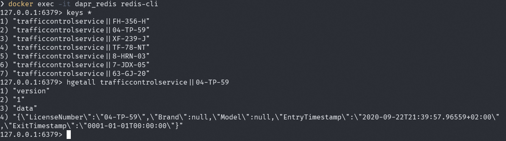

# Assignment 3 - Add Dapr state management

## Assignment goals

In order to complete this assignment, the following goals must be met:

- The TrafficControl service saves the state of a vehicle (VehicleState class) using the state management building block after vehicle entry.
- The TrafficControl service reads, updates and saves the state of a vehicle using the state management building block after vehicle exit.

For both these tasks you can use the Dapr client for .NET.

## Step 1: Use Dapr state-management building block

1. Open the `Assignment 3` folder in this repo in VS Code.

2. Open the file `Assignment03/src/TrafficControlService/Controllers/TrafficController.cs` in VS Code.

3. Add a private const field in this file holding the name of the state-store:

   ```csharp
   private const string DAPR_STORE_NAME = "statestore";
   ```

4. Replace the call to the VehicleStateRepository to store the VehicleState in the `VehicleEntry` method with a call to the the Dapr client:

   ```csharp
   await daprClient.SaveStateAsync<VehicleState>(DAPR_STORE_NAME, msg.LicenseNumber, vehicleState);
   ```

5. Add an argument to the `VehicleExit` method that is used to inject the Dapr client:

   ```csharp
   public async Task<ActionResult> VehicleExit(VehicleRegistered msg, [FromServices] IHttpClientFactory httpClientFactory, [FromServices] DaprClient daprClient)
   ```

6. Replace the call to the VehicleStateRepository to retrieve the VehicleState in the `VehicleExit` method with a call to the the Dapr client:

   ```csharp
   // get vehicle state
   var state = await daprClient.GetStateEntryAsync<VehicleState>(DAPR_STORE_NAME, msg.LicenseNumber);
   ```

7. The state-data you receive from the Dapr client is not an instance of the `VehicleState` class anymore, but a `StateEntry<VehicleState>`. To get to the actual `VehicleState`, you need to use the `Value` property of the `StateEntry`. So change all statements in the `VehicleExit` method where a property is read from the state instance and add `.Value` to the statement. Here is an example:

   ```csharp
   string licenseNumber = state.Value.LicenseNumber;
   ```

8. Replace the call to the VehicleStateRepository to save the updated VehicleState in the `VehicleExit` method with a call to the the Dapr client:

   ```csharp
   // update state
   state.Value.ExitTimestamp = msg.Timestamp;
   await state.SaveAsync();
   ```

9. Now that you are using the Dapr state-management for storing vehicle state, remove everything with regards to the `VehicleStateRepository` from the code (do that in both the controller as the Startup class).

Now you're ready to test the application.

## Step 2: Test the application

1. Make sure no services from previous tests are running (close the command-shell windows).

2. Open a new command-shell window and go to the `Assignment03/src/GovernmentService` folder in this repo.

3. Start the Government service:

   ```
   dapr run --app-id governmentservice --app-port 6000 --dapr-grpc-port 50002 dotnet run
   ```

2. Open a new command-shell window and go to the `Assignment03/src/TrafficControlService` folder in this repo.

3. Start the TrafficControl service with a Dapr sidecar. The WebAPI is running on port 5000:

   ```
   dapr run --app-id trafficcontrolservice --app-port 5000 --dapr-grpc-port 50001 dotnet run
   ```

4. Open a new command-shell window and go to the `Assignment03/src/Simulation` folder in this repo.

5. Start the Simulation:

   ```
   dotnet run
   ```

You should see the same logs as before.

## Step 2: Verify the state-store

 Obviously, the behavior of the application is exactly the same as before. But are the VehicleState entries actually stored in the default Redis state-store? To check this, you will use the redis CLI inside the `dapr_redis` container that is used as state-store in the default Dapr installation.

1. Open a new command-shell window.

2. Execute the following command to start the redis-cli inside the running `dapr_redis` container:

   ```
   docker exec -it dapr_redis redis-cli
   ```

3. In the redis-cli enter the following command to get the list of keys of items stored in the redis cache:

   ```
   keys *
   ```

   You should see a list of entries with keys in the form `"trafficcontrolservice||<license-number>"`.

4. Enter the following command in the redis-cli to get the data stored with this key (change the license-number to one in the list you see):

   ```
   hgetall trafficcontrolservice||04-TP-59
   ```

5. You should see something similar to this:

   

As you can see, the data is actually stored in the redis cache. The cool thing about Dapr is that multiple components exist that implement the state-management building-block. So without changing any code but only specifying a different Dapr configuration, you could use an entirely different storage mechanism. If you're up for it, try to swap-out redis with another state provider (see the [dapr-documentation on state management](https://github.com/dapr/docs/blob/master/concepts/state-management/README.md)).


## Next assignment

Make sure you stop all running processes before proceeding to the next assignment.

Go to [assignment 4](../Assignment04/README.md).