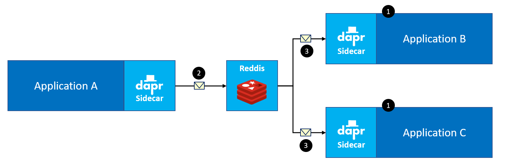

# Assignment 4 - Add pub/sub messaging

In this assignment, you're going to add Dapr **publish/subscribe** messaging to send messages from the simulation to the TrafficControl service and from the TrafficControl service to the Government service.

## Dapr pub/sub building block

The publish/subscribe pattern allows your microservices to communicate with each other purely by sending messages. In this system, the producer of a message sends it to a topic, with no knowledge of what service will receive the message. A messages can even be sent if there's no consumer for it.

Similarly, a consumer will receive messages from a topic without knowledge of what producer sent it. This pattern is especially useful when you need to decouple microservices from one another.

1. Consumers subscribe to a (or multiple) topic(s).
2. Producers send messages to a topic.
3. The pub/sub component will deliver a copy of the message to each subscriber to the topic the message was sent to.

For this hands-on assignment, this is all you need to know about this building-block. If you want to get more detailed information, read the [introduction to this building-block](https://github.com/dapr/docs/blob/master/concepts/publish-subscribe-messaging/README.md) in the Dapr documentation.

## Assignment goals

In order to complete this assignment, the following goals must be met:

1. The simulation uses the Dapr client to send messages over pub/sub to the TrafficControl service (vehicle entry and vehicle exit).
2. The TrafficControl service uses the Dapr client to send messages to the Government service (for communicating speeding violations to the CJIB).

## DIY instructions

First open the `Assignment 4` folder in this repo in VS Code. Then open the [Dapr documentation](https://github.com/dapr/docs) and start hacking away. Make sure you use the default Redis pub/sub component provided out of the box by dapr.

## Step by step instructions

To get step-by-step instructions to achieve the goals, open the [step-by-step instructions](step-by-step.md).

## Next assignment

Make sure you stop all running processes before proceeding to the next assignment.

Go to [assignment 5](../Assignment05/README.md).
