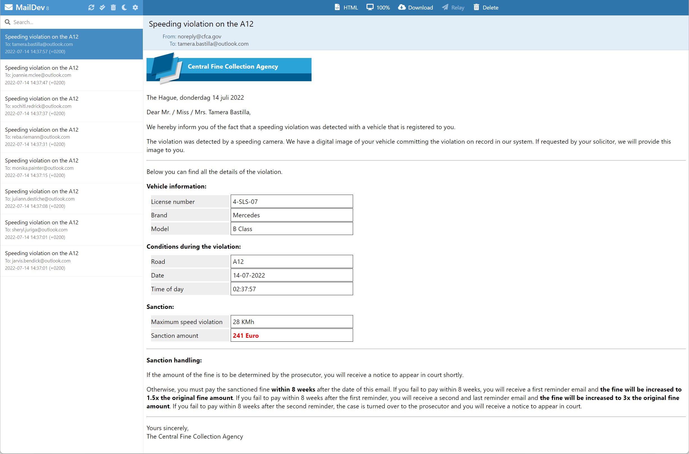

# Assignment 5 - Add a Dapr output binding

## Assignment goals

To complete this assignment, you must reach the following goals:

- The FineCollectionService uses the Dapr SMTP output binding to send an email.
- The SMTP binding calls a development SMTP server that runs as part of the solution in a Docker container.

This assignment targets number **4** in the end-state setup:


## Step 1: Run the SMTP server

In this assignment, you will use [MailDev](https://github.com/maildev/maildev) as your SMTP server. This is a development SMTP server that doesn't actually send out emails (by default), but collects them and shows them in an inbox type web application it has built-in. This is extremely handy in test or demo scenarios.

You will run this server as a Docker container:

1. Open the terminal window in VS Code.

1. Start a MailDev SMTP server by entering the following command:

   ```console
   docker run -d -p 4000:80 -p 4025:25 --name dtc-maildev maildev/maildev:latest
   ```

This will pull the docker image `maildev/maildev:latest` from Docker Hub and start it. The name of the container will be `dtc-maildev`. The server will be listening for connections on port `4025` for SMTP traffic and port `4000` for HTTP traffic. This last port is where the inbox web app will run for inspecting the emails.

If everything goes well, you should see some output like this:


> If you see any errors, make sure you have access to the Internet and are able to download images from Docker Hub. See [Docker Hub](https://hub.docker.com/) for more info.

The container will keep running in the background. If you want to stop it, enter the following command:

```console
docker stop dtc-maildev
```

You can then start the container later by entering the following command:

```console
docker start dtc-maildev
```

If you are done using the container, you can also remove it by entering the following command:

```console
docker rm dtc-maildev -f
```

Once you have removed it, you need to start it again with the `docker run` command shown at the beginning of this step.

> For your convenience, the `src-java/Infrastructure` folder contains Powershell scripts for starting the infrastructural components you'll use throughout the workshop. You can use the `src-java/Infrastructure/maildev/start-maildev.sh` script to start the MailDev container.
>
> If you don't mind starting all the infrastructural containers at once (also for assignments to come), you can also use the `src-java/Infrastructure/start-all.sh` script.

## Step 2: Use the Dapr output binding in the FineCollectionService

You will add code to the FineCollectionService so it uses the Dapr SMTP output binding to send an email:

1. Open the file `src-java/FineCollectionService/src/main/java/dapr/fines/violation/ViolationProcessor.java` in VS Code.

1. Inspect the code of the `processSpeedingViolation` method. There's a TODO comment at the end of the method. You'll add code to complete this TODO and actually send an email.

1. Add an import statement in the `ViolationProcessor` class so you can use the Dapr client:

     ```java
     import io.dapr.client.DaprClient;
     ```

1. Add an instance variable `daprClient` of type `DaprClient`, and an instance variable `emailGenerator`of type `EmailGenerator`. Also update the constructor to accept similar arguments:

   ```java
   private final DaprClient daprClient;
   private final EmailGenerator emailGenerator;
   private final FineCalculator fineCalculator;
   private final VehicleRegistrationClient vehicleRegistrationClient;

   public ViolationProcessor(final DaprClient daprClient,
                             final EmailGenerator emailGenerator,
                             final FineCalculator fineCalculator,
                             final VehicleRegistrationClient vehicleRegistrationClient) {
       this.daprClient = daprClient;
       this.emailGenerator = emailGenerator;
       this.fineCalculator = fineCalculator;
       this.vehicleRegistrationClient = vehicleRegistrationClient;
   }
   ```

1. In order to send an email, you first need to create a message body to send as email. The email body must contain the details of the speeding violation and the fine. The service already has a helper method to create an HTML email body. Replace the `// TODO` in the `CollectFine` method with this code:

    ```java
    var body = emailGenerator.createEmailBody(violation, vehicleInfo, fineText);
    ```

1. Next to the body, you need to specify the sender, recipient and subject of the email. With bindings, you specify this using a Map that contains `metadata`. Add the following code right after the creation of the body:

     ```java
    var metadata = Map.of(
            "emailFrom", "noreply@cfca.gov",
            "emailTo", vehicleInfo.ownerEmail(),
            "subject", String.format("Speeding violation on the %s", violation.roadId())
    );
    ```

1. Now you have everything you need to call the SMTP server using the Dapr output binding. Add the following code right after the creation of the metadata:

    ```java
    daprClient.invokeBinding("sendmail", "create", body, metadata, Void.class)
            .block();
    ```

     > The first two parameters passed into `invokeBinding` are the name of the binding to use and the operation (in this case 'create' the email).

That's it, that's all the code you need to write to send an email over SMTP.  

## Step 3: Configure the output binding

In this step you will add a Dapr binding component configuration file to the custom components folder you created in Assignment 3.

1. Add a new file in the `src-java/dapr/components` folder named `email.yaml`.

1. Open this file in VS Code.

1. Paste this snippet into the file:

   ```yaml
   apiVersion: dapr.io/v1alpha1
   kind: Component
   metadata:
     name: sendmail
   spec:
     type: bindings.smtp
     version: v1
     metadata:
     - name: host
       value: localhost
     - name: port
       value: 4025
     - name: user
       value: "_username"
     - name: password
       value: "_password"
     - name: skipTLSVerify
       value: true
   scopes:
     - finecollectionservice
   ```

As you can see, you specify the binding type SMTP (`bindings.smtp`) and you specify in the `metadata` how to connect to the SMTP server container you started in step 1 (running on localhost on port `4025`). The other metadata can be ignored for now.

Important to notice with bindings is the `name` of the binding. This name must be the same as the name used in the call to the bindings API as you did in the code in step 2:

```java
daprClient.invokeBinding("sendmail", "create", body, metadata, Void.class)
            .block();
```

## Step 4: Test the application

You're going to start all the services now. You specify the custom components folder you've created on the command-line using the `--components-path` flag so Dapr will use these config files:

1. Make sure no services from previous tests are running (close the terminal windows)

1. Make sure all the Docker containers introduced in the previous assignments are running (you can use the `src-java/Infrastructure/start-all.sh` script to start them).

1. Open the terminal window in VS Code and make sure the current folder is `src-java/VehicleRegistrationService`.

1. Enter the following command to run the VehicleRegistrationService with a Dapr sidecar:

   ```console
   dapr run --app-id vehicleregistrationservice --app-port 6002 --dapr-http-port 3602 --dapr-grpc-port 60002 --components-path ../dapr/components mvn spring-boot:run
   ```

1. Open a **new** terminal window in VS Code and change the current folder to `src-java/FineCollectionService`.

1. Enter the following command to run the FineCollectionService with a Dapr sidecar:

   ```console
   dapr run --app-id finecollectionservice --app-port 6001 --dapr-http-port 3601 --dapr-grpc-port 60001 --components-path ../dapr/components mvn spring-boot:run
   ```

1. Open a **new** terminal window in VS Code and change the current folder to `src-java/TrafficControlService`.

1. Enter the following command to run the TrafficControlService with a Dapr sidecar:

   ```console
   dapr run --app-id trafficcontrolservice --app-port 6000 --dapr-http-port 3600 --dapr-grpc-port 60000 --components-path ../dapr/components mvn spring-boot:run
   ```

1. Open a **new** terminal window in VS Code and change the current folder to `src-java/Simulation`.

1. Start the simulation:

   ```console
   mvn spring-boot:run
   ```

You should see the same logs as before. But now you should also be able to see the fine emails being sent by the FineCollectionService:

1. Open a browser and browse to [http://localhost:4000](http://localhost:4000).
1. Wait for the first emails to come in.
1. Click on an email in the inbox to see its content:
   

## Next assignment

Make sure you stop all running processes and close all the terminal windows in VS Code before proceeding to the next assignment.

Go to [assignment 6](../Assignment06/README.md).
